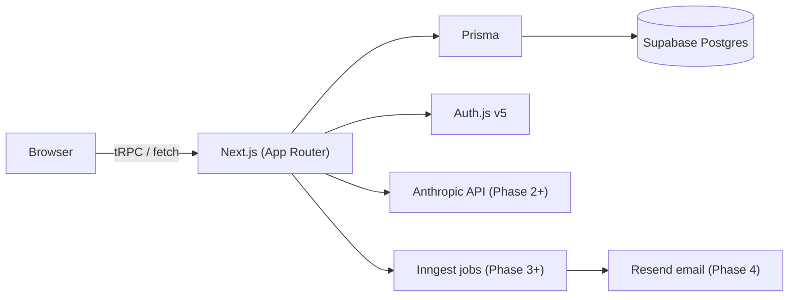

# TSA OS

> The operating system for the student-athlete's day.

An internal platform for a K-12 school for serious student-athletes (modeled on Texas
Sports Academy). Students do ~2 hours of AI-planned academics in the morning and athletic
training in the afternoon — and academic data and athletic data feed each other.

**Status: Phase 1 (Foundation) complete.** Scaffold, schema, auth, demo mode, app shell,
and a rich seed are in place. Features (AI plans, Smart Log, insights, digests, admin) land
in Phases 2–5. See `CLAUDE.md` for the full spec.

## Stack

Next.js 14 · React 18 · TypeScript strict · Tailwind CSS v3 · shadcn-style UI ·
tRPC v11 + TanStack Query · Prisma 5 + Postgres (Supabase) · Auth.js v5 (Google OAuth,
hand-rolled RBAC) · Sentry + PostHog (no-op without keys).

## Quick start

```bash
npm install                 # also runs prisma generate

# 1. Configure env — fill in DATABASE_URL, DIRECT_URL, AUTH_SECRET at minimum.
cp .env.example .env

# 2. Database — requires a real Postgres (e.g. Supabase free tier)
npm run db:migrate          # first run: creates migrations/ + applies schema
npm run db:seed             # ~3 weeks of realistic demo data

# 3. Run
npm run dev                 # http://localhost:3000
```

The app **boots without optional keys** (AI, email, Redis, analytics, Sentry, even
Google OAuth). Minimum required: `DATABASE_URL`, `DIRECT_URL`, `AUTH_SECRET`. Without
Google creds, use **Demo mode** at `/demo`.

### 📺 Watch the walkthrough

A 2-minute walkthrough link can be surfaced as a **"Watch the walkthrough"** button in
the landing hero — set `NEXT_PUBLIC_WALKTHROUGH_URL` to a Loom/YouTube link (the button
hides itself if unset). Likewise `NEXT_PUBLIC_GITHUB_URL` controls the footer GitHub link.

> **Walkthrough:** _add your Loom/YouTube link here once recorded._

### Supabase connection strings

Use the **Transaction pooler** string for `DATABASE_URL` (port 6543, `?pgbouncer=true`).
Use the **Direct** (non-pooled) string for `DIRECT_URL` (port 5432, no pgbouncer param).
Prisma uses `directUrl` for migrations; the pooler URL is what serverless functions hit.

### Demo mode

Go to `/demo` and pick a role — no OAuth required. Needs the seed to have been run.
Demo sessions are signed HTTP-only cookies scoped to the demo org data only.

## Scripts

| Script | What it does |
|---|---|
| `npm run dev` / `build` / `start` | Next.js dev / production build / serve |
| `npm run typecheck` | `tsc --noEmit` |
| `npm run lint` | ESLint (next lint) |
| `npm run db:migrate` / `db:push` | Prisma migrate dev / push (push skips migration files) |
| `npm run db:seed` | Seed ~3 weeks of demo data (idempotent: wipes then recreates) |
| `npm run db:studio` | Prisma Studio — visual DB browser |
| `npm run evals` | Eval suite (stub until Phase 5) |

## Auth & RBAC

- **Google OAuth** for STUDENT/COACH/ADMIN. Unknown emails (not on the seeded roster)
  hit a "ask your admin" screen instead of auto-creating an account.
- **JWT sessions** so RBAC runs in edge middleware (`src/middleware.ts`):
  `/student`, `/coach`, `/parent`, `/admin` each require their role.
- **Defense in depth**: tRPC procedures also check role (`src/server/api/trpc.ts`).
- **Parent** magic-link auth and the nightly digest pipeline arrive in Phase 4.

## Architecture



## Decisions & Tradeoffs

| Decision | Reasoning |
|---|---|
| **Next.js 14 / React 18 / Tailwind v3** (not the latest 16/19/v4) | The Auth.js v5 + tRPC v11 + shadcn ecosystem is not stable on Next 16 / React 19 yet. Deliberately pinned to stable versions to ship without being blocked by upstream breakage. Will upgrade after each package stabilises. |
| **Auth.js (NextAuth v5) not Clerk** | Auth patterns are owned in-repo: full visibility into sessions, roles, and the parent magic-link flow. Clerk is a black box for role logic and charges per MAU at scale. |
| **No WebSockets** | The spec's real-time feel (plan streaming) is achieved with `streamObject` + HTTP streaming. No long-lived connections to manage or scale. |
| **Inngest over raw cron** | Inngest gives step-based retries, per-step isolation (one failing student doesn't kill the digest run), local dev dashboard, and Vercel-native deploy. A cron hitting a single API route has none of that. |
| **Magic links for parents** | Parents are occasional, low-tech users. A password creates support burden; Google OAuth requires a Google account. A signed, expiring link in a digest email they already receive is the right UX. |
| **Zod everywhere** | Single source of truth for runtime shapes: tRPC inputs, AI outputs, env vars, webhook payloads. Type-safety to the edges. |

## Eval results

*(Populated in Phase 5)*

| Suite | Pass rate |
|---|---|
| smart-log | — |
| plan-generator | — |
